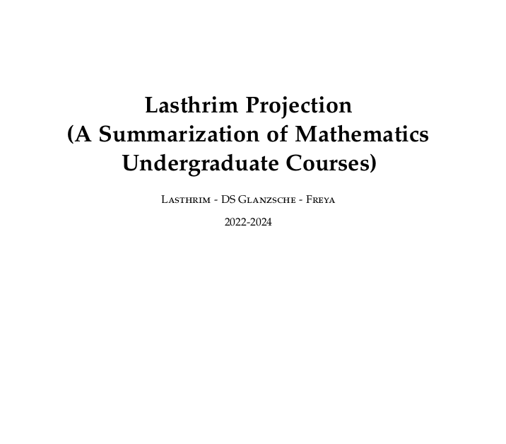

# LasthrimProjection
A mathematics undergraduate summarization book with JULIA and Python codes

Coverage:
1. Calculus
2. Basic Elementary Linear Algebra
3. Basic Discrete Mathematics
4. Basic Probability and Statistics
5. Basic Dynamical System and Bifurcation Theory
6. Differential Equations
7. Partial Differential Equation
8. Introduction to Real Analysis

# Lasthrim Projection Book

The current book can be seen here (in pdf format):

<a href="https://drive.google.com/file/d/1fYiJW_Nk3Mfb3WUaOPGrzcCzXxl-t0i0/view?usp=sharing">Lasthrim Projection book (July 18th, 2024)</a> 

## Lasthrim Projection' Galleries for JULIA-Calculus

| Chapter 0: Preliminaries | Chapter 1: Limits | 
| ------------- | ------------- | 
|  |  | 
| <a href="https://github.com/glanzkaiser/LasthrimProjection/blob/main/Source%20Codes/JULIA/Calculus/ch0-7-plotsincoswithpi.jl">ch0-7-plotsincoswithpi.jl</a> | <a href="https://github.com/glanzkaiser/LasthrimProjection/blob/main/Source%20Codes/JULIA/Calculus/ch1-1-plotlimitfunctions.jl">ch1-1-plotlimitfunctions.jl</a> | 

| Chapter 2: The Derivative | Chapter 3: Applications of the Derivative | 
| ------------- | ------------- | 
|  |  | 
| <a href="https://github.com/glanzkaiser/LasthrimProjection/blob/main/Source%20Codes/JULIA/Calculus/ch2-2-thederivative-leibniznotation.jl">ch2-2-thederivative-leibniznotation.jl</a> | <a href="https://github.com/glanzkaiser/LasthrimProjection/blob/main/Source%20Codes/JULIA/Calculus/ch3-5-applicationsofthederivative-example1-f(x).jl">ch3-5-applicationsofthederivative-example1-f(x).jl</a> | 

| Chapter 4: The Definite Integral | Chapter 5: Applications of the Integral | 
| ------------- | ------------- | 
|  |  | 
| <a href="https://github.com/glanzkaiser/LasthrimProjection/blob/main/Source%20Codes/JULIA/Calculus/ch4-6-thedefiniteintegral-numericalintegral-trapezoidalruleplot.jl">ch4-6-trapezoidalruleplot</a> | <a href="https://github.com/glanzkaiser/LasthrimProjection/blob/main/Source%20Codes/JULIA/Calculus/ch5-2-applicationsoftheintegral-problemno19.jl">ch5-2-solidofrevolution</a> | 

## Lasthrim Projection' Galleries for JULIA-Elementary Linear Algebra

| Chapter 1: Systems of Linear Equations and Matrices | Gaussian Elimination | 
| ------------- | ------------- | 
|  |  | 
| <a href="https://github.com/glanzkaiser/LasthrimProjection/blob/main/Source%20Codes/JULIA/Elementary%20Linear%20AlgebraElementaryLinearAlgebra.ipynb">ElementaryLinearAlgebra.ipynb</a> |  | 

| Chapter 1: Row Reduction with Variables | Chapter 2: Cramer's Rule | 
| ------------- | ------------- | 
|  |  | 
|  |  | 

| Chapter 3: Euclidean Vector Spaces | Chapter 3: Norm of a Vector in 3-D | 
| ------------- | ------------- | 
|  |  | 
|  |  | 

| Chapter 10: Fractals-Sierpinski Triangle | Coming soon | 
| ------------- | ------------- | 
|  |  | 
| <a href="https://github.com/glanzkaiser/LasthrimProjection/blob/main/Source%20Codes/JULIA/Elementary%20Linear%20Algebrach10-13-fractals-sierpinskitriangle1.jl">ch10-13-fractals-sierpinskitriangle1.jl</a> |  | 

## Lasthrim Projection' Galleries for JULIA-Discrete Mathematics

| Chapter 1: Logic and Proofs | Chapter 2: Sets, Functions, Sequences, and Sums | 
| ------------- | ------------- | 
|  |  | 
| <a href="https://github.com/glanzkaiser/LasthrimProjection/blob/main/Source%20Codes/JULIA/Discrete%20Mathematics/ch1-tautology.jl">ch1-tautology.jl</a> | <a href="https://github.com/glanzkaiser/LasthrimProjection/blob/main/Source%20Codes/JULIA/Discrete%20Mathematics/ch2-venndiagram.jl">ch2-venndiagram.jl</a> | 

## Lasthrim Projection' Galleries for JULIA-Differential Equations

| Chapter 1.1: Direction Fields| Chapter 1.2: Solutions of Some Differential Equations | 
| ------------- | ------------- | 
|  |  | 
| <a href="https://github.com/glanzkaiser/LasthrimProjection/blob/main/Source%20Codes/JULIA/Differential%20Equations/Elementary%20Differential%20Equations.ipynb">ElementaryDifferentialEquations.ipynb</a> | | 

| Chapter 2.2: Direction Field and Integral Curves| Chapter 2:  | 
| ------------- | ------------- | 
|  | | 
| <a href="https://github.com/glanzkaiser/LasthrimProjection/blob/main/Source%20Codes/JULIA/Differential%20Equations/Elementary%20Differential%20Equations.ipynb">ElementaryDifferentialEquations.ipynb</a> | | 

| MyLeo Pendulum | Wait for it | 
| ------------- | ------------- | 
|  |  | 
| <a href="https://github.com/glanzkaiser/LasthrimProjection/blob/main/Source%20Codes/JULIA/Differential%20Equations/pendulumplot1.jl">pendulumplot1.jl</a> | | 

## Lasthrim' Galleries for JULIA-Real Analysis

| Chapter 1: Logic and Proofs | Chapter 2: Quantifiers | 
| ------------- | ------------- | 
|  |  | 
| <a href="https://github.com/glanzkaiser/LasthrimProjection/blob/main/Source%20Codes/JULIA/Real%20Analysis/RealAnalysis.ipynb">RealAnalysis.ipynb</a> | | 

| Chapter 3: Rational Numbers | Chapter 4: Trigonometric Functions | 
| ------------- | ------------- | 
|  |  | 
| <a href="https://github.com/glanzkaiser/LasthrimProjection/blob/main/Source%20Codes/JULIA/Real%20Analysis/RealAnalysis.ipynb">RealAnalysis.ipynb</a> | |

| Chapter 5: Complex Numbers | Chapter 6: Sequences | 
| ------------- | ------------- | 
|  |  | 
| <a href="https://github.com/glanzkaiser/LasthrimProjection/blob/main/Source%20Codes/JULIA/Real%20Analysis/RealAnalysis.ipynb">RealAnalysis.ipynb</a> | |

## Lasthrim Projection' Galleries for Python-Calculus

| Cycloid Animation | Cycloid Around Cycloid | 
| ------------- | ------------- | 
|  |  | 
| <a href="https://github.com/glanzkaiser/LasthrimProjection/blob/main/Source%20Codes/Python/Calculus/cycloidanimation-creategif.py">Click</a> | <a href="https://github.com/glanzkaiser/LasthrimProjection/blob/main/Source%20Codes/Python/Calculus/cycloidplot-aroundcycloid.py">Click</a> | 

| 3D Prism | 3D Half Cylinder | 
| ------------- | ------------- | 
|  |   | 
| <a href="https://github.com/glanzkaiser/LasthrimProjection/blob/main/Source%20Codes/Python/Calculus/ch5-5-applicationsoftheintegral-problemno9-3dprism.py">Click</a> | <a href="https://github.com/glanzkaiser/LasthrimProjection/blob/main/Source%20Codes/Python/Calculus/ch5-5-applicationsoftheintegral-problemno12-3dhalfcylinder.py">Click</a> | 

| 3D Cylinder Plot | Solid of Revolution Around x and y | 
| ------------- | ------------- | 
|  |   | 
| <a href="https://github.com/glanzkaiser/LasthrimProjection/blob/main/Source%20Codes/Python/Calculus/ch5-2-applicationsoftheintegrals-cylindernumpy.py">Click</a> | <a href="https://github.com/glanzkaiser/LasthrimProjection/blob/main/Source%20Codes/Python/Calculus/ch5-2-applicationsoftheintegrals-solidofrevolution6comparingxy.py">Click</a> | 

## Lasthrim Projection' Galleries for Python-Differential Equations

| Vector Field | Vector Field Changing Color| 
| ------------- | ------------- | 
|  |  | 
| <a href="https://github.com/glanzkaiser/LasthrimProjection/blob/main/Source%20Codes/Python/Differential%20Equations/vectorfield2.py">Click</a> | <a href="https://github.com/glanzkaiser/LasthrimProjection/blob/main/Source%20Codes/Python/Differential%20Equations/vectorfield5-changingcolor.py">Click</a> | 

| Vector Field 3D | Electromagnetic Field Plot | 
| ------------- | ------------- | 
|  |  | 
| <a href="https://github.com/glanzkaiser/LasthrimProjection/blob/main/Source%20Codes/Python/Differential%20Equations/vectorfield3d.py">Click</a> | <a href="https://github.com/glanzkaiser/LasthrimProjection/blob/main/Source%20Codes/Python/Differential%20Equations/electromagneticfieldplot.py">Click</a> | 

| Heat Equation 3D Plot | Heat Equation 2D Plot | 
| ------------- | ------------- | 
|  |  | 
| <a href="https://github.com/glanzkaiser/LasthrimProjection/blob/main/Source%20Codes/Python/Differential%20Equations/heatequationsurfaceplot.py">Click</a> | <a href="https://github.com/glanzkaiser/LasthrimProjection/blob/main/Source%20Codes/Python/Differential%20Equations/heatequationplot2d.py">Click</a> | 

| Finite Difference 3D Cube | Finite Difference 3D Solution to Heat Equation | 
| ------------- | ------------- | 
|  |  | 
| <a href="https://github.com/glanzkaiser/LasthrimProjection/blob/main/Source%20Codes/Python/Differential%20Equations/finitedifference3dcube.py">Click</a> | <a href="https://github.com/glanzkaiser/LasthrimProjection/blob/main/Source%20Codes/Python/Differential%20Equations/finitedifferencesolutiontoheatequation3dsurface.py">Click</a> | 

| Inverse Laplace Transform Plot | Laplace Transform 3D Plot |
| ------------- | ------------- | 
|  |  | 
| <a href="https://github.com/glanzkaiser/LasthrimProjection/blob/main/Source%20Codes/Python/Differential%20Equations/laplacetransformplot.py">Click</a> | <a href="https://github.com/glanzkaiser/LasthrimProjection/blob/main/Source%20Codes/Python/Differential%20Equations/laplacetransform-3dplot-highlighted.py">Click</a> | 

| Laplace Transform Plot | Laplace Transform Computation | 
| ------------- | ------------- | 
|  |  | 
| <a href="https://github.com/glanzkaiser/LasthrimProjection/blob/main/Source%20Codes/Python/Differential%20Equations/laplacetransformplot.py">Click</a> | <a href="https://github.com/glanzkaiser/LasthrimProjection/blob/main/Source%20Codes/Python/Differential%20Equations/laplacetransformcomputation.py">Click</a> | 

| Fourier Transform Plot | Fourier Series Animation | 
| ------------- | ------------- | 
|  |   | 
| <a href="https://github.com/glanzkaiser/LasthrimProjection/blob/main/Source%20Codes/Python/Differential%20Equations/fouriertransformplot.py">Click</a> | <a href="https://github.com/glanzkaiser/LasthrimProjection/blob/main/Source%20Codes/Python/Differential%20Equations/fourierseriesanimation.py">Click</a> | 

| Fourier Series: Time to Frequency Spectrum | Fourier Series 3 Sine Waves | 
| ------------- | ------------- | 
|  |   | 
| <a href="https://github.com/glanzkaiser/LasthrimProjection/blob/main/Source%20Codes/Python/Differential%20Equations/fourierseries-converttimetofrequencyspectrum.py">Click</a> | <a href="https://github.com/glanzkaiser/LasthrimProjection/blob/main/Source%20Codes/Python/Differential%20Equations/fourierseries-generate3sinewaves.py">Click</a> | 

| Fourier Series 3D Synthesis DFT | Fourier Series Real Form | 
| ------------- | ------------- | 
|  |   | 
| <a href="https://github.com/glanzkaiser/LasthrimProjection/blob/main/Source%20Codes/Python/Differential%20Equations/fourierseries-3dsynthesisplot.py">Click</a> | <a href="https://github.com/glanzkaiser/LasthrimProjection/blob/main/Source%20Codes/Python/Differential%20Equations/fourierseries-realform.py">Click</a> | 

| Fourier Series Computing | Fourier Series DFT | 
| ------------- | ------------- | 
|  |   | 
| <a href="https://github.com/glanzkaiser/LasthrimProjection/blob/main/Source%20Codes/Python/Differential%20Equations/fourierseries-computation.py">Click</a> | <a href="https://github.com/glanzkaiser/LasthrimProjection/blob/main/Source%20Codes/Python/Differential%20Equations/fourierseries-dfttransform.py">Click</a> | 

## Lasthrim Projection' Galleries for Python-Partial Differential Equations

| Heat Equation 1 dimension | Fourier Series Computation and Plot | 
| ------------- | ------------- | 
|  |  | 
| <a href="https://github.com/glanzkaiser/LasthrimProjection/blob/main/Source%20Codes/Python/Partial%20Differential%20Equations/ch2-pde-heatequation1dplot.py">Click</a> | <a href="https://github.com/glanzkaiser/LasthrimProjection/blob/main/Source%20Codes/Python/Partial%20Differential%20Equations/ch2-pde-fourierseries-computation.py">Click</a> | 

## Lasthrim Projection' Galleries for Python-Recursive

| Maze Solver | Sliding Tile Solver |
| ------------- | ------------- | 
|  |  | 
| <a href="https://github.com/glanzkaiser/LasthrimProjection/blob/main/Source%20Codes/Python/Recursive/mazesolver.py">Click</a> | <a href="https://github.com/glanzkaiser/LasthrimProjection/blob/main/Source%20Codes/Python/Recursive/slidingtilesolver.py">Click</a> | 

| Barnsley Fern | Sierpinski Carpet | 
| ------------- | ------------- | 
|  |  | 
| <a href="https://github.com/glanzkaiser/LasthrimProjection/blob/main/Source%20Codes/Python/Recursive/fractal-barnsleyfern2.py">Click</a> | <a href="https://github.com/glanzkaiser/LasthrimProjection/blob/main/Source%20Codes/Python/Recursive/fractal-sierpinskicarpet.py">Click</a> | 

| Koch Snowflake | Hilbert Curve | 
| ------------- | ------------- | 
|  |  | 
| <a href="https://github.com/glanzkaiser/LasthrimProjection/blob/main/Source%20Codes/Python/Recursive/fractal-kochsnowflake.py">Click</a> | <a href="https://github.com/glanzkaiser/LasthrimProjection/blob/main/Source%20Codes/Python/Recursive/fractal-hilbertcurve.py">Click</a> | 

| Droste Maker | Flood Fill | 
| ------------- | ------------- | 
|  |  | 
| <a href="https://github.com/glanzkaiser/LasthrimProjection/blob/main/Source%20Codes/Python/Recursive/drostemaker.py">Click</a> | <a href="https://github.com/glanzkaiser/LasthrimProjection/blob/main/Source%20Codes/Python/Recursive/floodfill.py">Click</a> | 

# Source

1. Purcell, Edwin J., Varberg Dale, Rigdon, Steven E. Calculus 9th Edition
2. https://stackoverflow.com/
3. Rorres, Chris, Anton, Howard. Elementary Linear Algebra with Supplemental Applications 10th Edition
4. Boyce, William E., DiPrima, Richard C. Elementary Differential Equations and Boundary Value Problems 9th Edition
5. Simmons, George F., Differential Equations With Applications and Historical Notes 3rd Edition
6. Julia Discourse (https://discourse.julialang.org)
